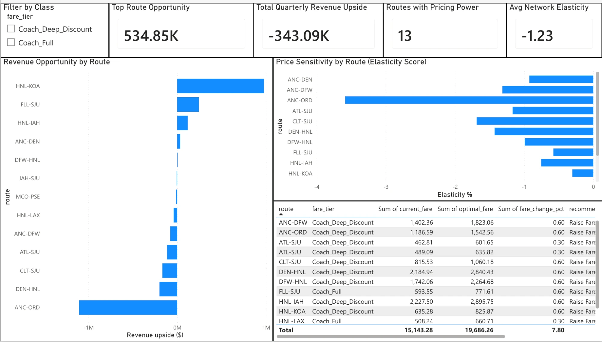
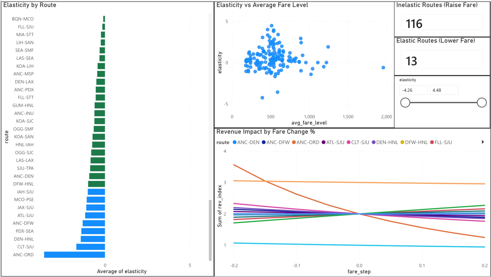

# Airline Fare Elasticity & Revenue Opportunity Model

> **"Are we charging the right price on the right route — or are we leaving millions on the table?"**
> This project answers that question using real government flight data.

---

## Live Dashboard

[View the Interactive Power BI Dashboard](https://app.powerbi.com/reportEmbed?reportId=9381f527-c42c-4120-86bd-bbdd0b5264df&autoAuth=true&ctid=a8eec281-aaa3-4dae-ac9b-9a398b9215e7)

---

## What Is This Project, In Plain English?

Imagine you're a Revenue Manager at an airline. Every day you're making calls like:

- *"Should we raise fares on the Miami–San Juan route this summer?"*
- *"Spirit just entered our Chicago–Denver market. Should we match their price or hold?"*
- *"Which routes can handle a 10% fare increase without losing passengers?"*

Right now, most of those decisions rely on gut feel, experience, or basic competitor watching.

**This project replaces guesswork with data.** It analyzes millions of real ticket purchases to measure exactly how sensitive passengers are to price changes on each route — and tells you where you can charge more, where you should hold steady, and where a price hike would backfire.

---

## The Core Idea: Price Sensitivity

Not all passengers are equal. Consider two types:

**The Business Traveler flying ANC → SEA**
> Has a meeting Monday morning. Needs that specific flight. Will pay whatever it costs.
> → **Not sensitive to price** (we call this *inelastic*)

**The Vacation Traveler flying FLL → SJU (Fort Lauderdale to San Juan)**
> Flexible dates. Spirit is offering $89. Why would they pay $200?
> → **Very sensitive to price** (we call this *elastic*)

This project measures exactly *how* sensitive each route is — and turns that into a revenue action.

---

## What We Found

We analyzed **125 U.S. routes** across **11 quarters (2022–2024)** — that's over **120 million real ticket records**.

### Routes Where You Can Raise Fares 

These routes have **captive passengers** — people who will fly regardless of price because there are few or no alternatives:

| Route | Why It's Captive | Quarterly Revenue Upside |
|---|---|---|
| **HNL → KOA** (Honolulu to Kona) | Island-hopper, no substitute | ~$577,000 |
| **HNL → IAH** (Honolulu to Houston) | Long-haul, limited options | ~$76,000 |
| **ANC → DEN** (Anchorage to Denver) | Remote Alaska market | ~$23,000 |

> **Fun Fact:** The Honolulu–Kona route showed that passengers barely flinch at higher fares. Even a 30% fare increase only reduces demand by about 8%. That's a goldmine for pricing teams.

### Routes Where a Fare Hike Would Backfire 

These routes have **budget airline competition** — passengers are actively price-shopping:

| Route | Why It's Competitive | Elasticity Score |
|---|---|---|
| **ANC → ORD** (Anchorage to Chicago) | Multiple carriers, leisure-heavy | **-4.3** (very elastic) |
| **CLT → SJU** (Charlotte to San Juan) | Heavy ULCC presence | -1.7 |
| **HNL → LAX** (Honolulu to LA) | Many carrier options | -1.3 |

> On ANC–ORD, a 10% fare increase would drop passenger demand by **43%**. You'd end up with fewer passengers AND less revenue. Classic pricing trap.

---

## How To Read The Key Number: Elasticity

The **elasticity score** is the single most important output of this model. Here's how to read it:

```
Elasticity = -0.5  →  Raise fares. Passengers barely notice.
Elasticity = -1.0  →  Breakeven. Raising fares won't help or hurt much.
Elasticity = -2.0  →  Be careful. Raising fares will lose you passengers fast.
Elasticity = -4.3  →  Do NOT raise fares. You'll lose 43 passengers for every 10% increase.
```

**The magic line is -1.0.** Routes above it (like -0.5 or -0.8) have pricing power. Routes below it (like -1.5 or -4.3) do not.

---

## The ULCC Effect

**ULCC = Ultra-Low-Cost Carrier** (think Spirit, Frontier, Allegiant — the airlines that charge you for a carry-on and a glass of water).

> **Fun Fact:** When Spirit enters a route, it doesn't just take market share — it *trains* passengers to shop on price. Even passengers who don't fly Spirit start expecting lower fares. Our model captured this effect: routes with heavy ULCC competition are significantly more price-elastic than routes without.

**What this means for pricing strategy:**
- On ULCC-heavy routes → Don't try to out-price them. Compete on product.
- On ULCC-free routes → You have pricing power. Use it.

---

## What's In This Repository

| Folder/File | What It Contains | Who Should Look At It |
|---|---|---|
| `data/output/revenue_opportunities.csv` | Route-by-route pricing recommendations | Revenue Managers, Pricing Teams |
| `data/output/elasticity_estimates.csv` | Price sensitivity score for each route | Analysts, Strategy Teams |
| `data/output/plots/` | Charts and visualizations | Everyone |
| `powerbi/dax_measures.md` | Instructions for the Power BI dashboard | BI Analysts |
| `python/` | Data download & processing code | Data Engineers |
| `r/` | Statistical model code | Data Scientists |

---

## The Charts

### Elasticity Distribution by Fare Class
Shows how price-sensitive passengers are across Coach, Discounted Coach, and Business class.
> Business class passengers are almost always inelastic — they're not paying out of pocket.

### Top 20 Revenue Opportunities
A ranked list of the routes with the biggest gap between what they're charging and what they *could* charge.

### ULCC Competition vs. Price Sensitivity
A scatter plot showing how more budget-airline competition = more price-sensitive passengers. The trend is clear.

*(All charts are in `data/output/plots/`)*

---

## Where Does The Data Come From?

**Source:** U.S. Department of Transportation — DB1B Dataset

This is **publicly available government data** that tracks every domestic airline ticket sold in the United States. It's not estimated or sampled — it's the actual transaction records reported by airlines to the federal government.

- **Time period:** 2022 Q1 through 2024 Q3 (11 quarters)
- **Records analyzed:** ~120 million individual ticket records
- **Routes covered:** Top 125 U.S. domestic routes by passenger volume
- **Fare classes:** Coach Full, Coach Discounted, Business

> **Fun Fact:** The DOT has been collecting this data since the 1990s. It's one of the most detailed public datasets in any industry in the world — and most airlines already have access to it but don't use it to its full potential.

---

## How It Was Built (For The Curious)

No jargon, we promise:

1. **Downloaded** all the government flight data automatically (Python)
2. **Cleaned** it — removed test tickets, bulk fares, international trips, and anything that didn't make sense (Python)
3. **Built a statistical model** that asks: *"When fares went up on this route, what happened to passenger numbers?"* — and measured that relationship precisely (R)
4. **Calculated the optimal fare** for each route using a standard economics formula: the price that maximizes revenue given how sensitive passengers are (R)
5. **Packaged everything** into a Power BI dashboard so pricing teams can explore it interactively (Power BI)

---

## For Revenue Managers: How To Use The Outputs

**Step 1:** Open `data/output/revenue_opportunities.csv`

**Step 2:** Filter the `recommendation` column:
- `Raise Fare` → These routes have pricing power right now
- `Hold` → Fares are close to optimal already

**Step 3:** Look at the `opportunity_tier` column:
- `High` → Act on this first
- `Medium` → Worth reviewing next cycle
- `Low` → Monitor but no urgent action

**Step 4:** Check the `elasticity` column to understand *why*:
- Closer to 0 (like -0.3) → Very safe to raise fares
- Closer to -1 (like -0.9) → Raise fares cautiously
- Below -1 (like -1.5) → Hold or lower fares

**Step 5:** Use the Power BI dashboard to simulate "what if we raised fares by 10% on this route?" before making any decisions.

---

## Bottom Line

This model turns 120 million data points into one clear answer for every route: **raise, hold, or lower.**

It doesn't replace the Revenue Manager's judgment — it gives them the data to back it up.

> *"In God we trust. All others must bring data."* — W. Edwards Deming

---

*Built using Python, R, and DOT DB1B public data. Dashboard in Power BI.*

---

## Dashboard Screenshots

### Executive Summary


### Route Deep Dive

